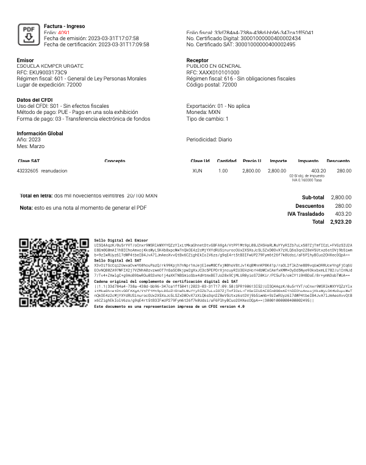
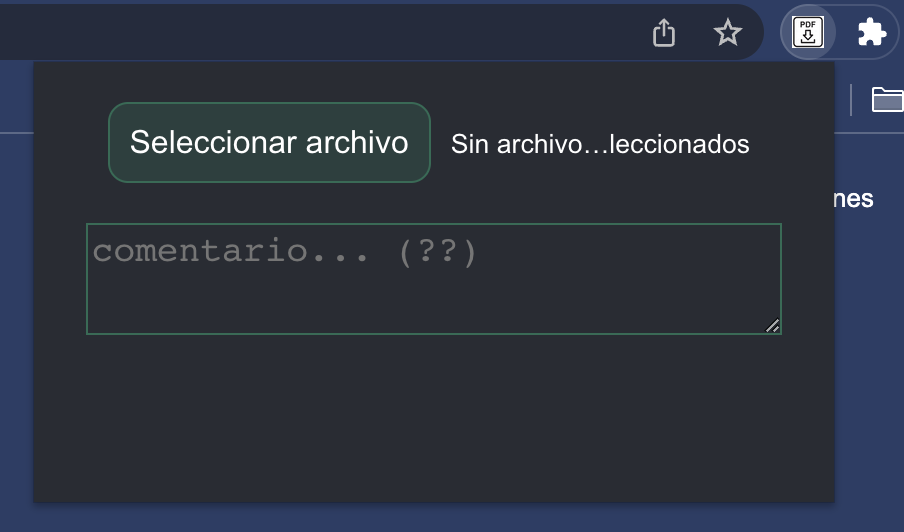
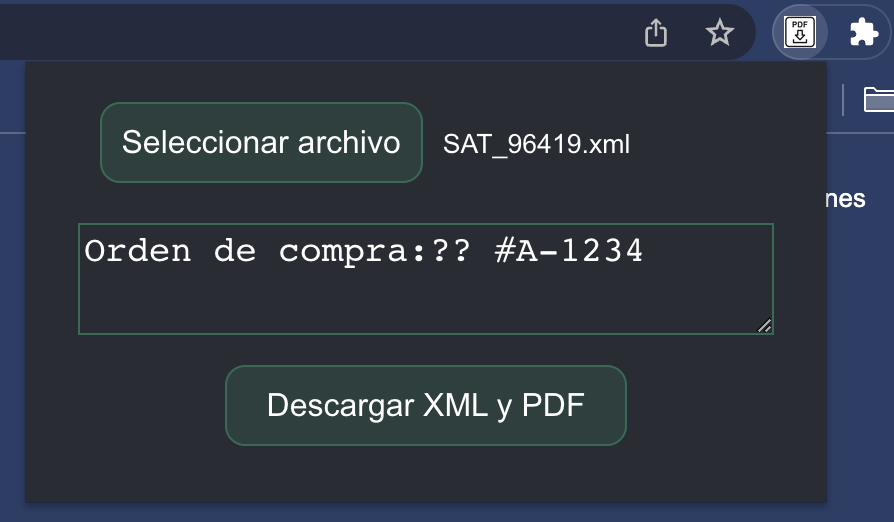

# Chrome Extension with React 18 and Webpack 5

A chrome extension for generating PDF invoices from CFDI 4.0 XML

Based on this great boilerplate https://github.com/lxieyang/chrome-extension-boilerplate-react. Is recommended to review the Readme and Issues.

### Output preview (pdf)

### Extension Popup preview

## Features

- This chrome extension allows the user to generate a PDF invoice from a CFDI 4.0 xml file (mexican tax invoice format)
- Add comments or notes to de PDF (not possible to get them from de xml)
- Personalize file names and logo
- Generate the respective QR code
- Generate invoice strings required
- Accept global invoice
- Break down taxes and discounts for each concept
- Generate total text string
- Add pagination if Pages > 1
- Minimalistic design
- and more...

## Installing and Running

1. Check if your [Node.js](https://nodejs.org/) version is >= **18**.
2. Clone this repository.
3. Create `options.ts` file from `options.example.ts`.
4. Update to desire logo `logo.png`.
5. Run `npm install` to install the dependencies.
6. Run `npm start`
7. Load your extension on Chrome following:
   1. Access `chrome://extensions/`
   2. Check `Developer mode`
   3. Click on `Load unpacked extension`
   4. Select the `build` folder.
